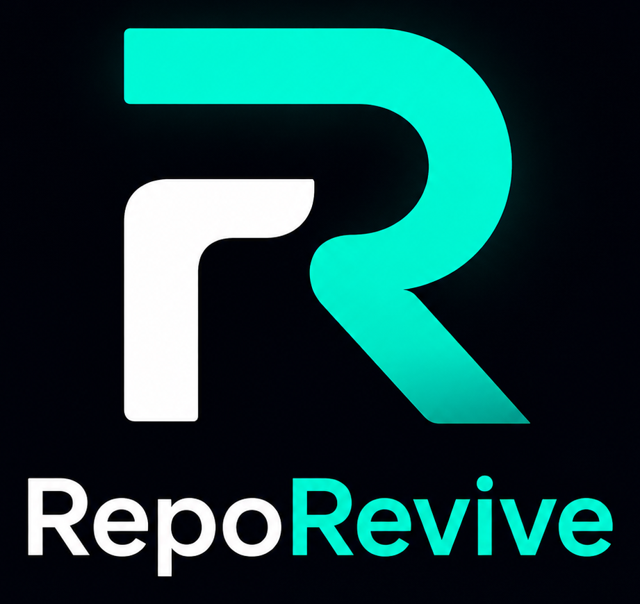
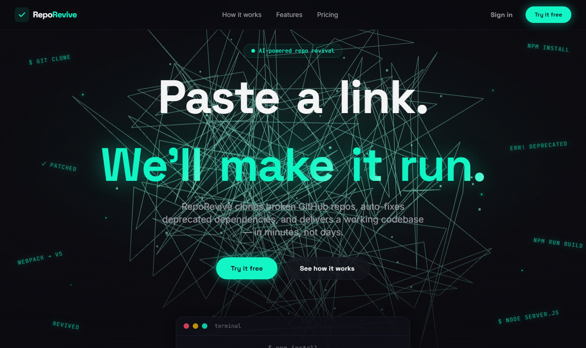
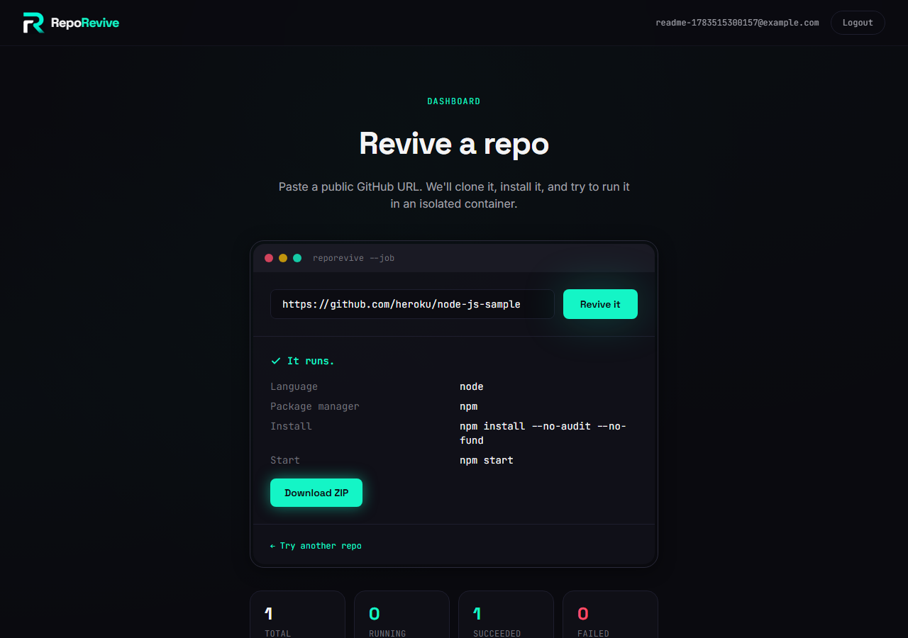

<div align="center">



**Paste a broken GitHub repo. Get back a diagnosis, an AI-attempted fix, and a working zip — or a clear explanation of why it couldn't be saved.**

[](https://nodejs.org)
[](https://www.typescriptlang.org/)
[](https://react.dev/)
[](https://expressjs.com/)
[](https://www.docker.com/)
[](https://www.sqlite.org/)
[](https://platform.openai.com/)
[](LICENSE)

</div>

<br>

<p align="center">
  
</p>

RepoRevive clones a public GitHub repo into an isolated Docker container, detects its stack, installs
and runs it, and — if that fails — has an AI diagnose *why* before attempting a fix. Every run produces
a plain-English report: what broke, what was tried, and either a downloadable working zip or an honest
account of what couldn't be fixed.

It's a portfolio-scale demo of an end-to-end AI agent pipeline: sandboxed execution, tool-calling
constrained to three explicit actions, and a UI that shows its work rather than a black box.

<p align="center">
  
</p>

---

## Contents

- [How it works](#how-it-works)
- [Features](#features)
- [Tech stack](#tech-stack)
- [Project structure](#project-structure)
- [Getting started](#getting-started)
- [Environment variables](#environment-variables)
- [API reference](#api-reference)
- [Job lifecycle](#job-lifecycle)
- [Isolation & security model](#isolation--security-model)
- [Out of scope](#out-of-scope-by-design)
- [Known limitations](#known-limitations)
- [License](#license)

---

## How it works

```
 paste a repo URL
        │
        ▼
┌───────────────────┐   git clone --depth 1     ┌──────────────────────────┐
│  detect container  │ ─────────────────────────▶│  alpine/git (throwaway)  │
│  (stack detection) │◀────────────────────────── │  read package.json /     │
└─────────┬──────────┘   language + entrypoint    │  requirements.txt / etc. │
          │                                        └──────────────────────────┘
          ▼
┌───────────────────────────────────────────────────────────────┐
│  run container — node:20 or python:3.12, no host mounts,      │
│  1 GiB RAM / 1 CPU / pids limit                                │
│                                                                 │
│   clone → install → run  ──── succeeds ────────────────────┐  │
│      │                                                       │  │
│      └── fails ──▶ diagnose (AI) ──▶ fix loop (AI, 3 tools) │  │
│                        │                    │                │  │
│                        │        retest install + run         │  │
│                        │                    │                │  │
│                        └── still broken? repeat, up to 5x ──┘  │
│                                     │                            │
│                              exhausted → failed                 │
└───────────────────────────────────────────────────────────────┘
                                     │
                    succeeded ───────┴─────── failed / unsupported_stack
                        │                              │
                 zip + copy out                  attempts preserved
                        │                              │
                        ▼                              ▼
               GET /jobs/:id/download        GET /jobs/:id/report(.md)
```

The AI never gets a shell. When install or run fails, `pipeline.ts` — the only module allowed to import
`dockerode` — hands the AI modules plain data (error logs, file contents) and a set of injected
functions scoped to the job's own container. Everything under `src/ai/` only ever sees an `OpenAI`
client and that interface.

## Features

**Repo intake**
- Validates the URL is a well-formed `github.com/<owner>/<repo>` link before doing anything — rejects SSH URLs, embedded credentials, and non-GitHub hosts
- Jobs are created and queued immediately (`202`), then processed by a small in-process worker so the API never blocks on a clone

**Stack detection**
- **Node** — npm, yarn, or pnpm by lockfile; corepack-pins a Node-20-compatible pnpm version when a repo doesn't declare its own; start command falls back `scripts.start` → `scripts.dev` → `index.js`/`server.js`/`app.js`/`src/index.js`/`main.js` → `package.json#main`
- **Python** — pip or Poetry by `pyproject.toml` contents; entry fallback `app.py` → `main.py` → `manage.py` (run as a real Django `runserver`, not a bare invocation) → `wsgi.py` → `server.py`
- Monorepos (npm/yarn/pnpm workspaces, Lerna, Nx) and Pipenv repos are recognized and reported with a specific explanation instead of a generic "unsupported" message

**Sandboxed execution**
- One throwaway container per job, no host volume mounts, memory/CPU/pids limits, `no-new-privileges`
- A server that's still alive after the run timeout counts as success, same as a script that exits `0`

**AI diagnosis + fix loop**
- On failure, classifies the error into one of six categories (deprecated package, breaking major-version change, native build failure, missing env var, runtime version mismatch, unknown) via a structured JSON call
- For package-related failures, a follow-up call suggests a specific upgrade path (`bcrypt@3.0.0 → bcrypt@5.1.0`, with a reason)
- The diagnosis feeds into a tool-calling fix attempt with exactly three tools — `read_file`, `write_file`, `run_command` — scoped to the job's workspace, up to 5 attempts, re-testing install/run after each one
- Falls back to `unknown` gracefully on any API error (bad key, network failure) rather than crashing the job

**Reports & delivery**
- `GET /jobs/:id/report` and `/report.md` show every attempt's diagnosis, explanation, diff, and files changed, plus a plain-English final outcome
- Successful jobs are zipped inside the container and streamed back via `GET /jobs/:id/download`

**Auth & dashboard**
- Email/password auth with bcrypt + JWT; every job route is ownership-checked
- A dashboard shows live job progress, a stats row (total / running / succeeded / failed), and full history
- Anonymous visitors can paste a repo on the landing page — it's held in `sessionStorage` and revived automatically the moment they sign in, no re-typing

## Tech stack

| | |
|---|---|
| **Frontend** | React 19, React Router 7, Vite 8, Tailwind CSS 3, Framer Motion, Three.js (hero scene) |
| **Backend** | Node.js ≥20, Express 4, TypeScript 5.9, better-sqlite3, dockerode, OpenAI SDK |
| **Sandbox** | Docker (`alpine/git` for detection, `node:20` / `python:3.12` for execution) |
| **Auth** | bcryptjs, jsonwebtoken |

## Project structure

```
reporevive/
├── backend/
│   ├── src/
│   │   ├── index.ts, app.ts        # entry point + express wiring
│   │   ├── config.ts               # env vars, timeouts, image names, AI tunables
│   │   ├── types.ts                # Job, StackInfo, JobStatus
│   │   ├── db/                     # better-sqlite3 init + schema
│   │   ├── auth/                   # register/login, JWT middleware
│   │   ├── jobs/                   # routes, SQLite store, URL validation, async queue
│   │   ├── stack/                  # Node/Python stack detection
│   │   ├── sandbox/
│   │   │   ├── docker.ts           # dockerode helpers (create/exec/destroy, archive extraction)
│   │   │   └── pipeline.ts         # orchestrator — the only module touching both Docker and AI
│   │   ├── ai/
│   │   │   ├── client.ts           # OpenAI client singleton
│   │   │   ├── diagnose.ts         # failure classification
│   │   │   ├── upgradeSuggest.ts   # dependency upgrade suggestions
│   │   │   ├── fixLoop.ts          # tool-calling fix attempt
│   │   │   ├── types.ts            # DiagnosisResult, SuggestedUpgrade, FixAttempt, ToolExecutors
│   │   │   └── prompts/            # system prompts, one file per AI call
│   │   └── report/                 # JSON + Markdown report rendering
│   └── storage/                    # SQLite DB + result zips (gitignored, created at runtime)
│
├── frontend/
│   └── src/
│       ├── pages/                  # Landing, Login, Register, Dashboard
│       ├── components/             # ReviveWidget, JobHistoryList, DashboardStats, Hero, ...
│       ├── context/                # AuthContext
│       ├── hooks/                  # useJobPolling, useJobsList
│       └── lib/                    # api client, job status labels, pending-repo handoff
│
└── docs/screenshots/
```

## Getting started

### Prerequisites

- **Node.js 20+**
- **Docker Desktop**, running, with Linux containers
- An **OpenAI API key** — optional to run the app at all, but required for diagnosis/fix-loop to do
  anything beyond falling back to `unknown` (see [Known limitations](#known-limitations))

### Backend

```bash
cd backend
npm install
cp .env.example .env    # edit JWT_SECRET / OPENAI_API_KEY as needed
npm run dev              # http://localhost:3000
```

### Frontend

```bash
cd frontend
npm install
npm run dev              # http://localhost:5173
```

Open `http://localhost:5173`, register an account, and paste a public repo — try
`https://github.com/heroku/node-js-sample` for a clean success path.

## Environment variables

**`backend/.env`**

| Variable | Default | Description |
|---|---|---|
| `PORT` | `3000` | API port |
| `JWT_SECRET` | — | Signing secret for auth tokens — change this in any real deployment |
| `OPENAI_API_KEY` | — | Needed for diagnosis and the fix loop to actually classify/fix anything |
| `STORAGE_DIR` | `./storage` | Where the SQLite DB and result zips live |
| `MAX_CONCURRENT_JOBS` | `2` | How many jobs the in-process queue runs at once |

**`frontend/.env`**

| Variable | Default | Description |
|---|---|---|
| `VITE_API_URL` | `http://localhost:3000` | Base URL the frontend calls |

## API reference

All `/api/jobs/*` routes require `Authorization: Bearer <token>` and are scoped to the requesting user.

| Method | Path | Description |
|---|---|---|
| `POST` | `/api/auth/register` | `{ email, password }` → `201 { token, user }` |
| `POST` | `/api/auth/login` | `{ email, password }` → `200 { token, user }` |
| `POST` | `/api/jobs` | `{ repoUrl }` → `202 { id, status }`, processed asynchronously |
| `GET` | `/api/jobs` | Current user's job history, newest first |
| `GET` | `/api/jobs/:id` | Poll status, detected stack, attempts so far |
| `GET` | `/api/jobs/:id/download` | Streams the result zip (`succeeded` jobs only) |
| `GET` | `/api/jobs/:id/report` | Structured JSON report — diagnosis, diffs, final outcome |
| `GET` | `/api/jobs/:id/report.md` | Same report as a downloadable Markdown file |
| `GET` | `/api/jobs/:id/logs` | Full structured log trace of the job as JSON (`{ jobId, events[] }`) |
| `GET` | `/health` | Liveness check |

## Job lifecycle

```
queued → cloning → detecting → installing / running
                                       │
                          success ─────┴───── failure
                             │                   │
                        succeeded          fixing ⇄ installing / running   (up to 5x)
                                                   │
                                     success ──────┴────── exhausted
                                        │                     │
                                   succeeded               failed

  no manifest found / Pipenv / monorepo detected → unsupported_stack (no attempt made)
```

## Isolation & security model

- Every job gets its own container; no host volume mounts; containers are destroyed once the job ends
- Memory, CPU, and process-count limits on every container; `no-new-privileges` set
- The AI never receives shell or SSH access — only three named tools (`read_file`, `write_file`,
  `run_command`), and `pipeline.ts` strips absolute paths and `../` traversal before touching the
  container
- Every job and report route checks `job.userId === req.userId` — a 404, not a 403, on mismatch, so
  job existence isn't leaked to other users
- File writes from the fix loop are base64-encoded before being written inside the container, so
  arbitrary AI-authored content never needs shell-escaping

## Out of scope (by design)

This is an MVP, not a hardened platform. Explicitly not supported:

- Private repos, GitHub OAuth, PR auto-creation, batch processing, CI integration
- Languages other than Node.js and Python
- Full monorepo support, Pipenv (both are detected and reported clearly rather than attempted)

## Known limitations

- **No `OPENAI_API_KEY`?** The app still runs — every failure just cycles through 5 quick, gracefully-failing
  diagnosis attempts (each ends in `category: "unknown"`) before marking the job `failed`, in a few
  seconds rather than hanging.
- **SQLite** means single-instance only — fine for a demo, not for horizontal scaling.
- **The fix loop's diff isn't a true patch** — it's a unified diff for the report, generated from
  before/after file snapshots, not something meant to be reapplied with `git apply`.

## License

MIT — see [LICENSE](LICENSE).
